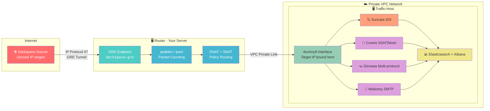
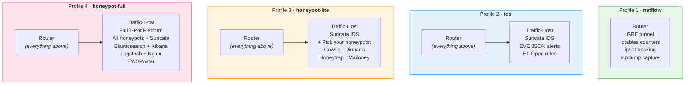

# darkspace-tools

A modular toolkit for monitoring, analyzing, and interacting with darkspace (unused IP) traffic
using GRE tunnels, iptables-based flow counting, Suricata IDS, and T-Pot honeypots.

---

## What is Darkspace?

Unused IP address ranges should receive **zero** legitimate traffic. Anything that arrives
is inherently suspicious — scanners, botnets, worms, backscatter from DDoS attacks.
Monitoring this "darkspace" gives you a low-noise, high-signal view of malicious activity
on the internet.

**Why monitor it?**

- **Threat intelligence**: See scanning campaigns as they happen — before they reach your production systems
- **Research**: Characterize internet background radiation, track botnet growth, study worm propagation
- **SOC enrichment**: Feed darkspace observations into your SIEM for correlation with production alerts
- **Early warning**: Spikes in darkspace activity often precede large-scale attacks

---

## Architecture



**Key design decisions:**
- **Policy routing** ensures reply packets preserve the original target IP as source — attackers interact with what looks like a real host
- **VPC isolation** keeps the honeypot off the public internet — no direct inbound access, everything goes through the router
- **Modular profiles** — deploy only what you need, from bare packet counting to a full honeypot ecosystem
- **Ansible automation** — every component is reproducible, idempotent, and version-controlled
- **Kernel-level counting** — iptables raw table rules count packets with zero userspace overhead

---

## Deployment Profiles

darkspace-tools supports **four deployment profiles**, each building on the previous one.
You don't need the full honeypot to get value — the `netflow` profile alone gives you
real-time visibility into who is scanning your darkspace, using nothing but a single VM
and kernel-native tools.



### Profile 1: `netflow` — Packet Counting & Flow Export

> **"I just want to see what's hitting my darkspace."**

The lightest deployment. A single VM receives darkspace traffic over a GRE tunnel and
counts it using kernel-native iptables rules — no containers, no cloud dependencies,
no additional software required.

| | |
|---|---|
| **Infrastructure** | One Linux VM (your router) |
| **RAM** | 512 MB minimum |
| **Disk** | < 50 MB |
| **Monthly cost** | ~$4–6 (smallest cloud VM) or free (on-prem) |
| **Setup time** | ~5 minutes |
| **Cloud required?** | No — works on any Linux box with a public IP |

**What you get:**
- **GRE tunnel** receiving darkspace traffic from a remote collector
- **iptables raw-table counters** — packets/bytes by interface, destination, source network, protocol, port
- **ipset** tracking of darkspace source networks and target IPs
- **tcpdump** capture on the GRE interface for pcap-level analysis
- **Optional: kernel NetFlow export** via `ipt_NETFLOW` module — real NetFlow v5/v9/IPFIX to any collector
- **Optional: softflowd** — userspace NetFlow export if you prefer not to build a kernel module

**Who this is for:**
- Network researchers studying internet background radiation
- SOC teams wanting a low-cost darkspace sensor feeding their SIEM
- Anyone who wants to answer "what is scanning my unused IPs?" without running containers
- Pilots — try this first, then upgrade to `ids` or `honeypot-lite` when you want more

**Example: what does the output look like?**

```
# iptables -t raw -L NETFLOW -n -v
Chain NETFLOW (2 references)
 pkts  bytes target  prot opt in            out           source       destination
 1.2M   89M RETURN  all  --  darkspace-gre  *            0.0.0.0/0    0.0.0.0/0    /* gre-inbound */
  32K  2.1M RETURN  tcp  --  darkspace-gre  *            0.0.0.0/0    0.0.0.0/0    tcp dpt:22 /* ssh-probes */
  18K  1.1M RETURN  tcp  --  darkspace-gre  *            0.0.0.0/0    0.0.0.0/0    tcp dpt:445 /* smb-probes */
  12K  780K RETURN  tcp  --  darkspace-gre  *            0.0.0.0/0    0.0.0.0/0    tcp dpt:23 /* telnet-probes */
 8.9K  534K RETURN  tcp  --  darkspace-gre  *            0.0.0.0/0    0.0.0.0/0    tcp dpt:80 /* http-probes */
```

See [docs/NETFLOW_FORWARDING.md](docs/NETFLOW_FORWARDING.md) for the full netflow guide,
including kernel module NetFlow export, softflowd, GRE setup, and ipset management.

---

### Profile 2: `ids` — Intrusion Detection

> **"I want to know *what* the scanners are doing, not just that they exist."**

Adds a traffic-host VM running **Suricata IDS** with Emerging Threats rulesets.
Darkspace traffic is forwarded from the router to the traffic-host via your private
VPC network. Suricata inspects every packet and generates structured alerts.

| | |
|---|---|
| **Infrastructure** | Router + one traffic-host VM |
| **RAM** | 2 GB (traffic-host) |
| **Disk** | ~300 MB |
| **Monthly cost** | ~$18–24 |
| **Setup time** | ~15 minutes |
| **Cloud required?** | Yes (or two machines on a private LAN) |

**What you get (in addition to netflow):**
- **Suricata IDS** processing all darkspace traffic in real-time
- **EVE JSON** structured alert output — one JSON object per event
- **ET Open rules** — thousands of community-maintained detection signatures
- **fast.log** — one-line human-readable alert summaries
- **Protocol decoding** — HTTP, DNS, TLS, SSH, SMB, and more extracted into fields

**Who this is for:**
- Security teams that want structured alert data, not just packet counters
- Anyone feeding threat data into Splunk, Elastic, or another SIEM
- Researchers who want to classify scanning activity by attack type

---

### Profile 3: `honeypot-lite` — Pick Your Honeypots

> **"I want to interact with attackers and capture credentials/malware — but I'll pick which services."**

Adds Docker-based honeypot containers alongside Suricata. You choose which ones to deploy
during setup — run just Cowrie for SSH credential capture, or add Dionaea for malware
collection, or any combination.

| | |
|---|---|
| **Infrastructure** | Router + one traffic-host VM |
| **RAM** | 2 GB (traffic-host) |
| **Disk** | ~500 MB |
| **Monthly cost** | ~$18–24 |
| **Setup time** | ~20 minutes |
| **Cloud required?** | Yes (or two machines on a private LAN) |

**Available honeypot services:**

| Service | Protocols | What It Captures |
|---------|-----------|-----------------|
| **Cowrie** | SSH (22), Telnet (23) | Login credentials, attacker commands, session recordings, downloaded files |
| **Dionaea** | FTP, HTTP, SMB, SQL, SIP, and more | Malware samples (saved to disk with SHA256), connection metadata in SQLite |
| **Honeytrap** | POP3, IMAP | Email protocol probes and exploitation attempts |
| **Mailoney** | SMTP (25) | Spam messages, credential harvesting attempts |
| **Suricata** | All (passive) | IDS alerts on all traffic (always included) |

**Who this is for:**
- Researchers who want credential and malware data without the overhead of running every service
- Teams with limited resources who want to target specific attack vectors
- Anyone who wants SSH brute-force intel — deploy Cowrie alone and you'll see hundreds of credential attempts per day

---

### Profile 4: `honeypot-full` — Complete T-Pot Ecosystem

> **"Give me everything — all honeypots, full ELK stack, dashboards, the works."**

Deploys the full [T-Pot](https://github.com/telekom-security/tpotce) platform from
Deutsche Telekom. This is a production-grade honeypot ecosystem with centralized logging,
Kibana dashboards, and optional data sharing with the T-Pot community.

| | |
|---|---|
| **Infrastructure** | Router + one traffic-host VM |
| **RAM** | 4 GB+ (traffic-host) — 8 GB recommended |
| **Disk** | ~3 GB (more for Elasticsearch data) |
| **Monthly cost** | ~$24–48 |
| **Setup time** | ~60 minutes (docker pulls) |
| **Cloud required?** | Yes (or two machines on a private LAN) |

**What you get (in addition to everything above):**
- **All honeypot containers** — Cowrie, Dionaea, Honeytrap, Mailoney, and Suricata
- **Elasticsearch 8.x** — full-text search, aggregations, and retention of all honeypot logs
- **Kibana 8.x** — pre-built dashboards for attack visualization, geo-mapping, timeline analysis
- **Logstash** — log pipeline normalization and enrichment
- **Nginx** — reverse proxy with TLS for the web management interface (port 64297)
- **EWSPoster** — optional: share your data with Deutsche Telekom's Early Warning System

**Who this is for:**
- Organizations running a dedicated darkspace monitoring program
- Academic researchers needing a full dataset (structured logs + dashboards + raw pcap)
- Teams that want Kibana dashboards without building their own ELK pipeline

---

## Quick Start

```bash
# 1. Clone
git clone https://github.com/jamesrahenry/darkspace-tools.git
cd darkspace-tools

# 2. Bootstrap your router
sudo bash scripts/bootstrap-router.sh

# 3. Interactive setup (picks profile, configures IPs)
sudo bash scripts/setup.sh

# 4. Deploy
sudo bash scripts/deploy.sh

# 5. Verify
make diagnose
```

See [docs/QUICKSTART.md](docs/QUICKSTART.md) for the full 5-minute guide.

## What You Can Do

### With any profile (netflow and above):
- Count packets by source network, destination IP, protocol, port
- Capture traffic with tcpdump for offline analysis
- Detect scanning campaigns in real-time
- Export real NetFlow v5/v9/IPFIX to any collector (via kernel module or softflowd)
- Track darkspace source networks with ipset

### With ids or higher:
- Get Suricata IDS alerts on darkspace traffic
- Match against ET Open / ET Pro rulesets
- Export structured EVE JSON alerts to your SIEM

### With honeypot-lite or higher:
- Capture SSH/Telnet credentials and attacker commands (Cowrie)
- Collect malware samples with SHA256 hashes (Dionaea)
- Log SMTP spam attempts (Mailoney)
- Record full attacker sessions

### With honeypot-full:
- All of the above plus Kibana dashboards with geo-mapping and timelines
- Elasticsearch for full-text search across all honeypot logs
- EWSPoster for sharing with Deutsche Telekom's threat intel community

## Documentation

| Guide | Description |
|-------|------------|
| [QUICKSTART](docs/QUICKSTART.md) | 5-minute getting started guide |
| [SETUP](docs/SETUP.md) | Detailed step-by-step setup |
| [ARCHITECTURE](docs/ARCHITECTURE.md) | Topology, traffic flow, policy routing |
| [NETFLOW_FORWARDING](docs/NETFLOW_FORWARDING.md) | GRE tunnels, iptables counting, ipset management |
| [REPORTING](docs/REPORTING.md) | Data export per profile, SIEM integration |
| [ANALYSIS](docs/ANALYSIS.md) | Packet capture, IOC extraction, threat intel |
| [MONITORING](docs/MONITORING.md) | Health checks, alerting, log rotation |
| [TEARDOWN](docs/TEARDOWN.md) | Data export, infrastructure destruction |
| [TROUBLESHOOTING](docs/TROUBLESHOOTING.md) | Common issues and fixes |
| [SECURITY](docs/SECURITY.md) | Threat model, hardening, incident response |
| [CLOUD_PROVIDERS](docs/CLOUD_PROVIDERS.md) | AWS, GCP, Hetzner, bare-metal adaptation |
| [UPGRADING](docs/UPGRADING.md) | Profile changes, adding services, updates |

## Repository Layout

```
├── ansible/                    # Ansible playbooks and templates
│   ├── deploy-all.yml          # Main orchestrator (profile-aware)
│   ├── deploy-router.yml       # GRE tunnel + NAT + policy routing
│   ├── deploy-traffic-host.yml # Target IP binding + routing
│   ├── deploy-honeypot.yml     # Docker + T-Pot/containers
│   ├── bootstrap-system.yml    # System hardening
│   ├── dynamic-inventory.py    # Auto-discover traffic-hosts
│   └── templates/              # Jinja2 templates for configs
├── scripts/                    # Shell scripts
│   ├── setup.sh                # Interactive setup wizard
│   ├── deploy.sh               # Main deployment script
│   ├── teardown.sh             # Destroy infrastructure
│   ├── diagnose.sh             # 9-category diagnostics
│   └── configure-*.sh          # Component-specific setup
├── configs/                    # Configuration files
├── systemd/                    # Systemd service units
├── examples/                   # Example configs (safe to commit)
├── docs/                       # Full documentation
└── Makefile                    # Common operations
```

## Make Targets

```
make help         Show all targets
make setup        Interactive setup wizard
make deploy       Deploy with selected profile (PROFILE=netflow|ids|honeypot-lite|honeypot-full)
make teardown     Destroy infrastructure
make diagnose     Run all diagnostics
make status       Quick health check
make lint         Shellcheck + ansible-lint
make check-sanitization  Verify no real IPs in codebase
```

## Prerequisites

- **OS:** Debian 12+ or Ubuntu 22.04+ on the router
- **Access:** Root or sudo on the router machine
- **GRE source:** A darkspace traffic source forwarding via GRE
- **Cloud (optional):** DigitalOcean account + `doctl` CLI (for ids/honeypot profiles)

## Contributing

See [CONTRIBUTING.md](CONTRIBUTING.md).

## License

[MIT](LICENSE)
